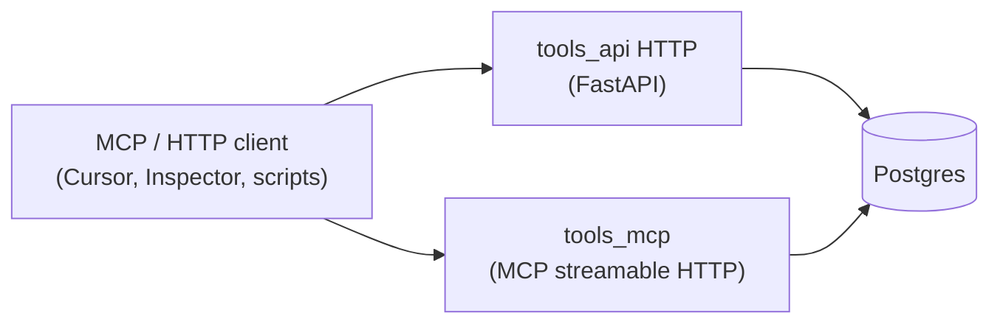

# Magic Boto — Project Plan

This document is the **single source of truth** for the magic-boto project: vision, architecture, data sources, and repo layout. Use it when planning or implementing features.

**Platform:** This project is designed for a **Windows** machine. Automation and scripting use **PowerShell**; avoid bash or Unix/Linux-only assumptions in docs and scripts.

---

## Vision and scope

**Goal:** A **data and tools backend** for Magic: The Gathering — card lookup, inventory, and related operations — with a **streamable HTTP MCP** surface so external LLM clients can call tools. **Orchestration and system prompts** live outside this repo (Cursor rules, desktop MCP hosts, Markdown under **`tasks/`**, etc.).

- **Data:** A Postgres backend with:
  - **Card definitions** — loaded into the **`magic_boto`** schema from **MTGJSON** (API v5 / per-set files; see `app.fetch` and `docs/DB-POPULATE-PLAN.md`).
  - **Your own MTG inventory** — cards you own, in `magic_boto` inventory tables.
- **APIs:** **`tools_api`**
  - **HTTP:** OpenAPI-described REST endpoints (e.g. MTGJSON card search, editions, inventory).
  - **MCP:** Same domain logic exposed as MCP tools over **streamable HTTP** (`/mcp` by default).

---

## Architecture

- **Postgres** holds the card catalog (MTGJSON) and app schema (inventory, etc.).
- **tools_api** (container) runs **Uvicorn** for `app.http.main:app` on one port.
- **tools_mcp** (same image, second service) runs **Uvicorn** for `app.mcp.asgi:app` on **`TOOLS_MCP_PORT`** (default **8765**).
- **No in-repo agent or chat UI**; connect any MCP-capable host to the MCP URL (see root **`docker-compose.yml`** and **`AGENTS.md`**).

### Rules and validation

- **Deterministic rules** (deck legality, formats, etc.) live in code under **`tools_api`**. Exposed via HTTP and/or MCP tool handlers as appropriate.

### RAG (optional, later)

- Can be added in **tools_api** (endpoints + optional pgvector) without a separate service.

---

## Components

| Component       | Role |
|-----------------|------|
| **Postgres**    | Card catalog + inventory. Consider **pgvector** later for RAG. |
| **tools_api**   | FastAPI HTTP app + shared domain services, DB, migrations, tasks. |
| **tools_mcp**   | MCP server (streamable HTTP) over the same codebase / image. |
| **mcp_inspector** | Optional Compose service for debugging MCP (see **`AGENTS.md`**). |

---

## Data sources

- **MTG JSON** — Primary for card definitions. Use AllPrintings or the v5 API. They offer SQL/SQLite builds to simplify loading into Postgres.
- **Alternatives (optional):** Scryfall or the [official MTG API](https://docs.magicthegathering.io/) for supplemental data.

---

## LLM / local inference (optional)

For experiments **outside** MCP (e.g. direct OpenAI-compatible calls to a local server):

- **LM Studio** — [lmstudio.ai](https://lmstudio.ai); OpenAI-compatible local server.
- **Ollama** — CLI-first alternative.

This repo does **not** ship an OpenAI chat proxy or agent process; use **MCP** for tool access from external clients.

---

## Monorepo layout

Root **`docker-compose.yml`** brings up **Postgres**, **tools_api**, **tools_mcp**, and optionally **mcp_inspector**.

| Path | Purpose |
|------|---------|
| `docs/` | Project plan and design notes. |
| `tasks/` | Optional Markdown instructions / prompts for human or agent workflows (not loaded by the server automatically). |
| `tools_api/` | HTTP app, MCP ASGI app, DB, migrations, Invoke tasks, Dockerfile. |
| `scripts/` | Miscellaneous helper scripts (repo root). |

### IDE and Python env

Open **`magic-boto.code-workspace`**. Use the **tools_api** folder’s interpreter (`.venv` under `tools_api/` after `uv sync`). Run **Ruff** and **mypy** from **`tools_api/`**.

---

## Summary of recommendations

| Area | Recommendation |
|------|------------------|
| Card data | MTG JSON (AllPrintings or v5 API); SQL/SQLite builds for Postgres ingestion. |
| Backend | Postgres; pgvector later if you add RAG. |
| Tool access | MCP streamable HTTP + OpenAPI HTTP from **tools_api**. |
| Prompts / agent behavior | Markdown and client rules under **`tasks/`** and repo docs; external MCP host. |

---

## For AI / Cursor

- This file is the **project north star** for scope and architecture.
- **Prefer existing libraries over custom code** where applicable.
- When implementing, align with **`AGENTS.md`** and this plan.
