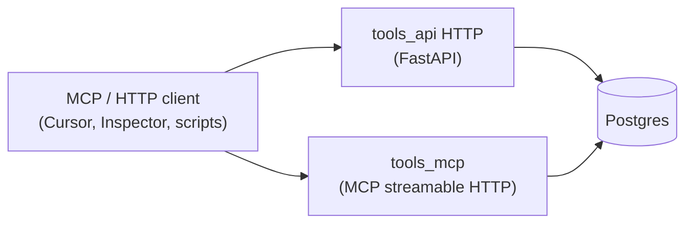

# Magic Boto — Project Plan

This document is the **single source of truth** for the magic-boto project: vision, architecture, data sources, and repo layout. Use it when planning or implementing features.

**Platform:** This project is designed for a **Windows** machine. Automation and scripting use **PowerShell**; avoid bash or Unix/Linux-only assumptions in docs and scripts.

---

## Vision and scope

**Goal:** A **Model Context Protocol (MCP)** server (streamable HTTP) as the **primary** way for LLM clients to drive **conversational card querying** over the **MTG catalog** and **imported inventory** — search, drill into printings, editions, and named collections — and **agent-assisted card intent tagging** (shared labels for roles, strategy, and deck-building intent). **HTTP/OpenAPI** exposes the same domain for scripts and integrations. **Orchestration and system prompts** live outside this repo (Cursor rules, desktop MCP hosts, Markdown under **`tasks/`**, etc.).

- **Data:** A Postgres backend with:
  - **Card definitions** — loaded into the **`magic_boto`** schema from **MTGJSON** (API v5 / per-set files; see `docs/DB-POPULATE-PLAN.md`, `app/services/mtgjson_fetch/`, and `uv run invoke fetch` from `tools_api/`).
  - **Your own MTG inventory** — cards you own, in `magic_boto` inventory tables (query and mutate via MCP tools).
- **APIs:** **`tools_api`**
  - **MCP:** Domain logic as MCP tools over **streamable HTTP** (`/mcp` by default) — **lead surface** for agents.
  - **HTTP:** OpenAPI-described REST endpoints (same capabilities for non-MCP callers).

---

## Architecture

- **Postgres** holds the card catalog (MTGJSON) and app schema (inventory, etc.).
- **tools_api** (container) runs **Uvicorn** for `app.cmd.serve_http:app` on one port.
- **tools_mcp** (same image, second service) runs **Uvicorn** for `app.cmd.serve_mcp.asgi:app` on **`TOOLS_MCP_PORT`** (default **8765**).
- **No in-repo agent or chat UI**; connect any MCP-capable host to the MCP URL (see root **`docker-compose.yml`** and **`AGENTS.md`**).

### Rules and validation

- **Deterministic rules** (deck legality, formats, etc.) live in code under **`tools_api`**. Exposed via HTTP and/or MCP tool handlers as appropriate.

### RAG (optional, later)

- Can be added in **tools_api** (endpoints + optional pgvector) without a separate service.

---

## Components

| Component       | Role |
|-----------------|------|
| **Postgres**    | Card catalog + inventory. Consider **pgvector** later for RAG. |
| **tools_api**   | FastAPI HTTP app + shared domain services, DB, migrations, tasks. |
| **tools_mcp**   | MCP server (streamable HTTP) over the same codebase / image. |
| **mcp_inspector** | Optional Compose service for debugging MCP (see **`AGENTS.md`**). |

---

## Data sources

- **MTG JSON** — Primary for card definitions. Use AllPrintings or the v5 API. They offer SQL/SQLite builds to simplify loading into Postgres.
- **Alternatives (optional):** Scryfall or the [official MTG API](https://docs.magicthegathering.io/) for supplemental data.

---

## LLM / local inference (optional)

For experiments **outside** MCP (e.g. direct OpenAI-compatible calls to a local server):

- **LM Studio** — [lmstudio.ai](https://lmstudio.ai); OpenAI-compatible local server.
- **Ollama** — CLI-first alternative.

This repo does **not** ship an OpenAI chat proxy or agent process; use **MCP** for tool access from external clients.

---

## Monorepo layout

Root **`docker-compose.yml`** brings up **Postgres**, **tools_api**, **tools_mcp**, and optionally **mcp_inspector**.

| Path | Purpose |
|------|---------|
| `docs/` | Project plan and design notes. |
| `tasks/` | Optional Markdown instructions / prompts for human or agent workflows (not loaded by the server automatically). |
| `tools-ui/` | Vite/React sources for MCP App UIs; build outputs are copied into `tools_api/app/mcp_tooling/ui_dist/`. |
| `tools_api/` | HTTP app, MCP ASGI app, DB, migrations, Invoke tasks, Dockerfile, Celery worker code. |

### IDE and Python env

Open **`magic-boto.code-workspace`**. Use the **tools_api** folder’s interpreter (`.venv` under `tools_api/` after `uv sync`). Run **Ruff** and **mypy** from **`tools_api/`**.

### `tools_api/app/` layout (post-restructure)

The older `app/http/`, `app/mcp/`, `app/schema/`, `app/fetch/`, `app/tag/` tree is **gone**. Current boundaries:

- **`app/cmd/`** — CLIs and ASGI/HTTP entrypoints (`serve_http`, `serve_mcp`, Celery, tag sweep/audit, inventory, fetch).
- **`app/http_routing/`** — FastAPI routers.
- **`app/mcp_tooling/`** — MCP server wiring (`server.py`), tools (`*_tools.py`), middleware.
- **`app/api_schema/`** — Pydantic request/response models (HTTP + MCP).
- **`app/services/`** — Domain logic (including `mtgjson_fetch/`).
- **`app/models/`**, **`app/db.py`** — SQLAlchemy ORM and session setup.

---

## Tag sweep, audit, and shared batches

Oracle tag **sweep** and **audit** use the Anthropic Messages Batch API. Shared batch lifecycle rows live in **`magic_boto.batches`**; sweep runs use **`magic_boto.tag_sweep`** and related join tables; audits use **`magic_boto.tag_audit`** (linked to a batch). Implementation: `app/models/batch_model.py`, `tag_audit_model.py`, `sweep_run_model.py`, `sweep_run_batch_model.py`, `sweep_run_batch_card_model.py`, plus repos and services under `app/services/` and `app/repository/`.

**Operator entrypoints (from `tools_api/`):**

- **`uv run invoke sweep.enqueue`** — enqueue sweep work (see task for flags; Celery continues the pipeline after submit).
- **`uv run invoke sweep.process`** / **`sweep.reset`** — process results or full reset for a tag.
- **`uv run invoke audit.enqueue`** — start or continue an audit (see task for `--audit-id`).
- **`uv run invoke batch.poll`** — enqueue Celery polling for batch UUIDs.

MCP tools for the same domain live under `app/mcp_tooling/sweep_tools.py` and `audit_tools.py` (e.g. enqueue / reset helpers).

---

## MTGJSON ingestion

- **Sync CLI:** `uv run invoke fetch` → `app/cmd/fetch.py` and `app/services/mtgjson_fetch/` (full-catalog style ingest as implemented there).
- **Async jobs (DB + Celery):** tables `mtgjson_fetch_jobs` / `mtgjson_fetch_job_editions`, worker `app/worker/process_mtgjson_fetch.py`, MCP tools in `app/mcp_tooling/mtgjson_fetch_tools.py`, UI page built from `tools-ui` into `app/mcp_tooling/ui_dist/`.

---

## Further reading

- **[DB-POPULATE-PLAN.md](DB-POPULATE-PLAN.md)** — schema + how to load catalog data.
- **[sweep-cost-optimisations.md](sweep-cost-optimisations.md)** — historical notes and **backlog** ideas for sweep cost/quality (not all implemented).

---

## Summary of recommendations

| Area | Recommendation |
|------|------------------|
| Card data | MTG JSON (AllPrintings or v5 API); SQL/SQLite builds for Postgres ingestion. |
| Backend | Postgres; pgvector later if you add RAG. |
| Tool access | MCP streamable HTTP + OpenAPI HTTP from **tools_api**. |
| Prompts / agent behavior | Markdown and client rules under **`tasks/`** and repo docs; external MCP host. |

---

## For AI / Cursor

- This file is the **project north star** for scope and architecture.
- **Prefer existing libraries over custom code** where applicable.
- When implementing, align with **`AGENTS.md`** and this plan.
