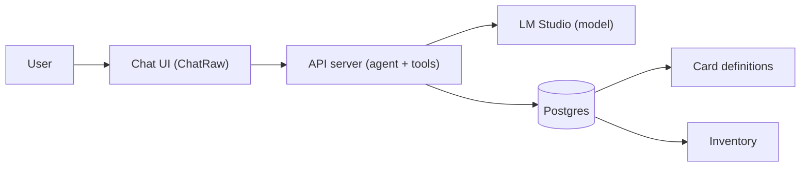

# Magic Boto — Project Plan

This document is the **single source of truth** for the magic-boto project: vision, architecture, data sources, LLM tooling, and monorepo layout. Use it when planning or implementing features.

**Platform:** This project is designed for a **Windows** machine. Automation and scripting use **PowerShell**; avoid bash or Unix/Linux-only assumptions in docs and scripts.

---

## Vision and scope

**Goal:** A tool that uses a **locally run LLM** to help build Magic: The Gathering decks.

- **Data:** A Postgres backend populated with:
  - **Card definitions** — primary source: **MTG JSON** (e.g. AllPrintings or API v5 at `https://mtgjson.com/api/v5/`). They provide JSON, SQL, and SQLite; builds update daily.
  - **Your own MTG inventory** — cards you own, in separate schema/tables.
- **API:** A single API server that exposes both **tool endpoints** (cards, deck validation, format rules) and an **OpenAI-compatible chat surface** so a generic chat UI can talk to an agent that uses those tools. The agent (orchestration + tool loop) and tools live in the same server; the LLM runs in LM Studio.

---

## Architecture

- **User** talks to a **chat UI** (e.g. ChatRaw) — no custom UI in the repo.
- The **chat UI** calls the API server at `/openapi/v1/chat/completions` (and optionally `/openapi/v1/models`). It sends one request and receives one final assistant message; it never sees tool calls.
- The **API server** is one FastAPI app that:
  - **Agent:** Exposes OpenAI-format routes under `/openapi/v1/`. For each chat request it runs the tool loop: call LM Studio → if the model returns `tool_calls`, execute tool logic **in-process** → call LM Studio again → repeat until the model returns a final answer. Returns only that final answer to the client.
  - **Tools:** Card lookup, deck validation, format rules, etc. Implemented as shared code; the agent calls it in-process. The same logic is exposed as HTTP routes (e.g. `/mtgjson/v1/cards/...`) for **contract clarity and debugging**.
- **LM Studio** runs the model locally (OpenAI-compatible API). The API server calls it; LM Studio never talks to Postgres or to the tool HTTP routes.
- **Postgres** holds the card catalog (MTGJSON) and app schema (inventory, etc.).

This is an **Agent-as-a-Backend** pattern: the client gets a single request/response; the server owns the tool loop.

### Rules and validation

- **Deterministic rules** (deck legality, Commander format, etc.) live in code (in the API app or a shared package). Exposed via HTTP for debugging and a clear tool contract. The agent uses this logic in-process when dispatching tools.

### RAG (optional, later)

- **Orchestration** (when to retrieve, inject into prompt): in the **agent** (same server).
- **Backend** (vector search, rules/card snippets): in the **API** (endpoints or shared code). Indexing/scripts can live under API or db. No separate RAG service.

---

## Components

| Component     | Role |
|---------------|------|
| **Postgres**  | Card catalog + inventory. Consider **pgvector** later for RAG. |
| **API server** | Single FastAPI app: agent (OpenAI chat under `/openapi/v1/`) + tools (MTGJSON, deck validate, rules). Agent runs the tool loop in-process; tool HTTP routes for contract/debug. |
| **LM Studio** | Local inference (OpenAI-compatible). API server calls it; it does not call the API. |
| **Chat UI**   | Existing solution (e.g. ChatRaw). Configure API base URL in the UI (e.g. `http://api:8000/openapi`). No custom UI in repo. |

---

## Data sources

- **MTG JSON** — Primary for card definitions. Use AllPrintings or the v5 API. They offer SQL/SQLite builds to simplify loading into Postgres.
- **Alternatives (optional):** Scryfall or the [official MTG API](https://docs.magicthegathering.io/) for supplemental data.

---

## LLM tooling

### Running the model

- **LM Studio** (recommended): Desktop app with a GUI for discovering, downloading, and running local models (e.g. Llama, Qwen). Exposes an OpenAI-compatible API (typically `http://localhost:1234/v1`), supports tool/function calling with compatible models.
- **Ollama:** CLI-first alternative; also exposes an OpenAI-compatible API.

### LM Studio setup and models

- **Install:** [lmstudio.ai](https://lmstudio.ai). In Settings, ensure the NVIDIA GPU is selected for inference.
- **Config:** Set **`OPENAI_PROXY_BASE_URL`** in repo `.env` (default `http://localhost:1234`). When the API runs in Docker and the proxy is on the host, use `http://host.docker.internal:1234`.
- **Server:** In LM Studio, start the **Local Server** (Develop → Local Server). The API (and later the agent) call this URL for `/v1/models` and `/v1/chat/completions`.
- **Models (tool calling + this project):** Use GGUF models that support function/tool calling. Good options:
  - **7B–14B (fast):** Qwen 2.5 7B/14B Instruct, Llama 3.2 8B Instruct, Mistral 7B Instruct v0.2. Quant: Q5_K_M or Q8_0.
  - **32B (higher quality, ~24 GB VRAM):** Qwen 2.5 32B Instruct, Llama 3.1 32B Instruct. Quant: Q4_K_M or Q5_K_M.
- **Quantization:** Prefer Q4_K_M / Q5_K_M / Q8_0. Avoid very low quants (e.g. Q2_K) for reliable tool use.
- **Reference hardware (this repo):** RTX 4090 (24 GB VRAM), 64 GB RAM — can run 32B quantized or 70B in low quant; 7B–14B recommended for speed and tool use.

### OpenAI-compatible surface (for the chat UI)

- **Path prefix:** Nest under `/openapi` so versioning stays under one namespace. Routes: `/openapi/v1/chat/completions`, `/openapi/v1/models`.
- **Required:** `POST /openapi/v1/chat/completions`. Recommended: `GET /openapi/v1/models` (or add model IDs manually in the UI).
- **Behavior:** The server performs the full tool loop and returns only the final assistant message. The UI never sees `tool_calls`. Until the agent loop is implemented, `/openapi/v1/models` and `/openapi/v1/chat/completions` pass through to LM Studio so you can test the UI and server architecture.

### Training (optional, later)

- Start **without** fine-tuning: a good system prompt + tool use + (optionally) RAG is often enough.
- If you later fine-tune: use **SFT/LoRA** (e.g. Unsloth, Axolotl, or Hugging Face **transformers + PEFT**). Expect a GPU with e.g. 8GB+ VRAM. **RLHF** is optional and out of scope for now.

---

## Monorepo layout

A root **docker-compose** at the repo root brings up the stack: Postgres, API (when containerized), and chat UI. Each subproject is one part of the stack.

| Path | Purpose |
|------|---------|
| `docs/` | Project plan and future design docs. |
| `db/` | Postgres schema, migrations, and/or scripts to ingest MTG JSON and inventory. |
| `api/` | Single API server: agent (OpenAI chat under `/openapi/v1/`) + tools (cards, deck, rules). |
| `ui/` | Config for the chat UI only (e.g. `ui/.env.example`, `ui/README.md`). No separate docker-compose; the `ui` service is defined in root compose. |

### IDE and multiple Python projects (open at repo root)

Pylance **ignores** `venvPath`/`venv` in pyrightconfig and uses the **selected Python interpreter** per workspace folder. So with the repo opened at root, the only way to get the right env per project is a **multi-root workspace**:

1. **Open `magic-boto.code-workspace`** (not the plain folder). The workspace defines two roots: `magic-boto` (repo) and `api`. The default interpreter is set to `api/.venv`, so files under `api/` use that venv and imports resolve.
2. **When you add another Python project:** add a third folder to the workspace and set its interpreter. Each project root gets its own interpreter.

Keep `api/pyrightconfig.json` for CLI tooling (e.g. Pyright/mypy run from that project’s directory). No root `pyrightconfig.json` is used when you open the workspace file.

---

## Summary of recommendations

| Area | Recommendation |
|------|----------------|
| Card data | MTG JSON (AllPrintings or v5 API); SQL/SQLite builds for Postgres ingestion. |
| Backend | Postgres; pgvector later if you add RAG. |
| API server | Single FastAPI app: agent + tools in one process; tool loop in-process; HTTP tool routes for contract/debug. |
| Run LLM | LM Studio (primary); Ollama as alternative. |
| Chat UI | Existing solution (ChatRaw); set API base URL in the UI to `http://<host>:<port>/openapi`. |
| Training | Optional; start with prompt + tools; later SFT/LoRA if needed; RLHF out of scope. |

---

## For AI / Cursor

- This file is the **project north star**. Prefer it for scope, architecture, and tech choices.
- When adding features or new services, align with the architecture and data sources described here.
- **Prefer existing libraries over custom code:** use official or standard libraries for types, protocols, and integrations (e.g. OpenAI API types from the `openai` package) instead of reimplementing from spec.
- In subsequent tasks, reference this doc (e.g. “see docs/PROJECT-PLAN.md” or “follow the plan in docs/PROJECT-PLAN.md”).
