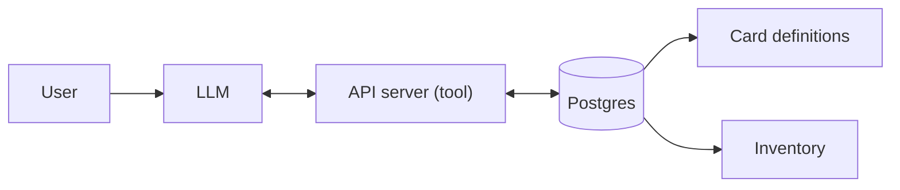

# Magic Boto — Project Plan

This document is the **single source of truth** for the magic-boto project: vision, architecture, data sources, LLM tooling, and monorepo layout. Use it when planning or implementing features.

**Platform:** This project is designed for a **Windows** machine. Automation and scripting use **PowerShell**; avoid bash or Unix/Linux-only assumptions in docs and scripts.

---

## Vision and scope

**Goal:** A tool that uses a **locally run LLM** to help build Magic: The Gathering decks.

- **Data:** A Postgres backend populated with:
  - **Card definitions** — primary source: **MTG JSON** (e.g. AllPrintings or API v5 at `https://mtgjson.com/api/v5/`). They provide JSON, SQL, and SQLite; builds update daily.
  - **Your own MTG inventory** — cards you own, in separate schema/tables.
- **API:** A separate API server that the LLM uses as a **tool** (e.g. search cards, check inventory, suggest decks).

---

## Architecture

- **User** talks to the **LLM** (local).
- The **LLM** calls the **API server** via tool/function calling (search, filter, suggest).
- The **API server** reads and writes **Postgres** (card catalog + inventory).

**Later (optional):** Add RAG/embeddings (e.g. **pgvector**) for semantic search over card text.

### What is RAG?

**RAG (Retrieval-Augmented Generation)** means giving the LLM access to external data at answer time instead of (or in addition to) whatever was in its training. In practice: you turn your data (e.g. card text, rules) into **embeddings** (vector representations), store them in a vector DB (e.g. Postgres with **pgvector**), and on each question you **retrieve** the most relevant chunks and inject them into the prompt. The model then “augments” its answer using that retrieved context. For deck building, RAG could let the LLM search card text by meaning (e.g. “cards that care about +1/+1 counters”) rather than only by keyword or structured filters.

---

## Components

| Component    | Role |
|-------------|------|
| **Postgres** | Card catalog + inventory. Consider **pgvector** later for RAG. |
| **API server** | Exposes endpoints the LLM calls as tools (language TBD: e.g. FastAPI, Node, Go). |
| **LLM layer** | Local inference (e.g. LM Studio). The API server is the “tool” the model calls. |

---

## Data sources

- **MTG JSON** — Primary for card definitions. Use AllPrintings or the v5 API. They offer SQL/SQLite builds to simplify loading into Postgres.
- **Alternatives (optional):** Scryfall or the [official MTG API](https://docs.magicthegathering.io/) for supplemental data.

---

## LLM tooling (software-dev-friendly, minimal ML)

### Running / interacting (priority)

- **LM Studio** (recommended): Desktop app with a GUI for discovering, downloading, and running local models (e.g. Llama, Qwen). Exposes an OpenAI-compatible API (typically `http://localhost:1234/v1`), supports tool/function calling with compatible models, and is well suited for stable sessions and experimenting with prompts.
- **Ollama:** CLI-first alternative; good for scripting and Docker; also exposes an OpenAI-compatible API at `http://localhost:11434`.

### Tool calling

The API server’s endpoints are exposed to the LLM as **tools**: each tool has a name, description, and parameters (e.g. JSON schema). LM Studio’s API (and Ollama’s) accept these tool definitions in the chat request and can return tool calls; your app runs the corresponding API requests and feeds results back to the LLM.

### Training (optional, later)

- Start **without** fine-tuning: a good system prompt + tool use + (optionally) RAG over card text is often enough.
- If you later fine-tune: use **Unsloth** or **Axolotl** (higher-level), or the Hugging Face **transformers + PEFT** stack. Expect to need a GPU with e.g. 8GB+ VRAM; treat this as optional.

---

## Monorepo layout (to be created)

A root **docker-compose** at the repo root brings up the stack (e.g. Postgres) for local development.

| Path | Purpose |
|------|---------|
| `docs/` | Project plan and future design docs. |
| `db/` | Postgres schema, migrations, and/or scripts to ingest MTG JSON and inventory. |
| `api/` | API server used by the LLM as a tool. |
| `llm/` (optional) | Scripts for talking to LM Studio (prompts, tool definitions), and later RAG/fine-tuning if needed. |

Exact names can be chosen when creating the first services.

### IDE and multiple Python projects (open at repo root)

Pylance **ignores** `venvPath`/`venv` in pyrightconfig and uses the **selected Python interpreter** per workspace folder. So with the repo opened at root, the only way to get the right env per project is a **multi-root workspace**:

1. **Open `magic-boto.code-workspace`** (not the plain folder). The workspace defines two roots: `magic-boto` (repo) and `api`. The default interpreter is set to `api/.venv`, so files under `api/` use that venv and imports resolve.
2. **When you add another Python project (e.g. `llm/`):** add a third folder to `magic-boto.code-workspace`: `{ "path": "llm", "name": "llm" }`. Then run **Python: Select Interpreter** and choose `llm\.venv\Scripts\python.exe` when you’re in a file under `llm/`; the IDE will remember that folder’s interpreter. Each project root gets its own interpreter; no symlinks and no single global venv.

Keep `api/pyrightconfig.json` (and later `llm/pyrightconfig.json`) for CLI tooling (e.g. Pyright/mypy run from that project’s directory). No root `pyrightconfig.json` is used when you open the workspace file.

---

## Summary of recommendations

| Area       | Recommendation |
|------------|----------------|
| Card data  | MTG JSON (AllPrintings or v5 API); SQL/SQLite builds for Postgres ingestion. |
| Backend    | Postgres; pgvector later if you add RAG. |
| API server | Separate service; LLM calls it via tool/function calling. |
| Run LLM    | LM Studio (primary); Ollama as CLI/scripting option. |
| Tool use   | LM Studio supports tool calling; API server = the tool backend. |
| Training   | Optional; start with prompt + tools; later: Unsloth / Axolotl / HF stack. |

---

## For AI / Cursor

- This file is the **project north star**. Prefer it for scope, architecture, and tech choices.
- When adding features or new services, align with the architecture and data sources described here.
- In subsequent tasks, reference this doc (e.g. “see docs/PROJECT-PLAN.md” or “follow the plan in docs/PROJECT-PLAN.md”).
