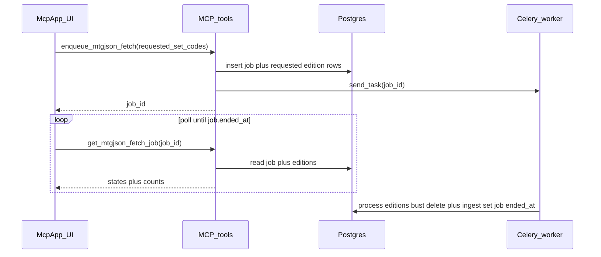

# Async MTGJSON fetch (DB + worker + MCP UI)

**In-repo copy:** this file mirrors the Cursor plan so it is visible in the workspace. The Cursor UI plan file may live under your user `.cursor/plans/` (`isProject: false`).

## Context (current code)

- Ingest is synchronous in `tools_api/app/services/mtgjson_fetch/fetch_job.py`: load `SetList`, build `pending`, loop per set with `bust_cache = set_code in always_refresh_set_codes`, commit per set inside `async with session.begin()`.
- MCP calls `execute_mtgjson_fetch` inline in `tools_api/app/mcp_tooling/mtgjson_fetch_tools.py` (no progress).
- Celery + `worker_session_scope` pattern: `tools_api/app/worker/materialize_sweep_batches.py`; MCP enqueue + poll: `tools_api/app/mcp_tooling/sweep_tools.py`, `tools-ui/src/sweep/SweepApp.tsx`.
- UI builds: `VITE_BUILD_TARGET` in `tools-ui/vite.config.ts`, `tools-ui/package.json`, pages under `tools-ui/pages/`.
- `tools_api/app/services/mtgjson_fetch/file_client.py` today uses **max-age freshness** for SetList (`check_freshness=True`) and optional `bust_cache` for per-set files. **Remove expiration-based behavior**; redownload only after **explicit file delete** (bust) tied to the job/edition flow.

## Schema (Alembic + ORM)

Tables in schema `magic_boto`, **TEXT + CHECK** for `state` via `tools_api/migrations/check_constraints.py`.

### `mtgjson_fetch_jobs`

- `id` UUID PK.
- `started_at` / `ended_at` timestamptz nullable — worker sets `started_at` when work begins; `ended_at` when terminal (success or failure).
- `error_message` TEXT nullable on failure.
- **No** `always_refresh_set_codes` (or any job-level bust list). Enqueue only creates **edition rows**.

### `mtgjson_fetch_job_editions`

- `id` UUID PK.
- `job_id` UUID FK → `mtgjson_fetch_jobs.id` ON DELETE CASCADE.
- `set_code` TEXT NOT NULL (uppercase MTGJSON code).
- `state` CHECK `('requested','inprogress','done')` (exact strings you wanted).
- `started_at` / `ended_at` nullable timestamptz.
- `updated_cards_count` INTEGER NOT NULL DEFAULT 0 — set at `done` from mapper payload (e.g. `len(payload.cards)`).
- UNIQUE (`job_id`, `set_code`).

ORM under `tools_api/app/models/`, export from `tools_api/app/models/__init__.py`. New migration revises current head `tools_api/migrations/versions/20260413_f8e9d0c1b2a3_cards_printing_side.py` (do not run migrate without user confirmation).

## Cache directory and file client

- Point MTGJSON cache at **`{app cache folder}/mtgjson/`** (replace current `mtg_json` path usage), via settings / `MtgJsonFileClient._resolve_cache_dir` wiring.
- **Remove freshness / max-age redownload logic** from `MtgJsonFileClient` (drop `check_freshness` + `mtgjson_cache_max_age_days` behavior, or stop using them everywhere).
- **Cache hit rule:** treat a cache hit as “decompressed `.json` exists” only (no mtime / age).
- **SetList:** at **job start**, delete the cached `SetList.json` (same as a bust) so each run sees a current catalog without a time-based policy.
- **Per-set:** when the worker ingests a set **as part of this job** (row exists for `(job_id, set_code)` and that set is being processed), **always delete** that set’s cached JSON first, then download — i.e. **always bust for edition rows that exist for the job** (matches “bust always for pending rows that exist”; once a row is created for a discovered set, it is treated the same).

## Worker + service refactor

1. **Celery** — `PipelineTaskName.PROCESS_MTGJSON_FETCH_JOB`, module `tools_api/app/worker/process_mtgjson_fetch.py`, register via import in `tools_api/app/worker/tasks.py`, `enqueue_process_mtgjson_fetch_job` in `tools_api/app/worker/__init__.py`.

2. **Orchestration**

   - Repo: create job + initial `requested` rows; load job + editions for status; transitions; job `error_message` / `ended_at`.
   - Worker builds the worklist from `SetList` + DB **using edition rows**, not a job-level bust list:
     - **New sets:** not yet in `magic_boto.editions`.
     - **Re-ingest:** `mtgjson_fetch_job_editions` exists for this job and `set_code` in `requested` (or `inprogress` if resuming).
   - For each set to process: ensure row exists (insert `requested` for newly discovered sets), move `requested` → `inprogress` (+ `started_at`), commit for UI poll.
   - **Bust:** delete per-set cached file as above; run download + existing `session.begin()` ingest.
   - Move → `done`, set `ended_at`, `updated_cards_count`, commit.
   - **Orphan requested rows** (code never appears in MTGJSON `SetList`, e.g. typo): **final pass** (a) mark each such edition row `done` with `updated_cards_count=0` and `ended_at` so the UI never leaves rows stuck in `requested`; (b) set **`error_message` on the job** listing the unknown set code(s). Still set job `ended_at` so polling can stop; the UI treats `error_message` as the failure signal for those codes.
   - `try/except`: set job `error_message` + `ended_at`, log `logger.exception`.

3. **Sync CLI** — keep `execute_mtgjson_fetch` + `app/cmd/mtgjson_fetch.py` synchronous (no DB job) for `invoke fetch` without Redis/Celery; align file client + cache path with worker (no freshness).

## MCP tools + UI

- Resource `ui://magic-boto/mtgjson-fetch` → `pages/mtgjson-fetch.html` in `tools_api/app/mcp_tooling/ui_dist/`.
- **`enqueue_mtgjson_fetch`**
  - Param: comma-separated set codes to insert as **`requested`** edition rows.
  - **Default behavior:** if the param is empty or whitespace, treat as **`SLD`** (one-click enqueue).
  - Parse with `parse_always_refresh_set_codes` (reuse validation/normalization).
  - Insert job + one `requested` row per code; commit; `enqueue_process_mtgjson_fetch_job(job_id)`; return `{ job_id, status }`; `meta` UI URI like sweep.
- **`get_mtgjson_fetch_job`** — read-only poll: job timestamps, `error_message`, editions list.

**Sync `mtgjson_fetch` MCP tool:** remove or alias to enqueue — pick at implementation time.

## tools-ui

- `tools-ui/pages/mtgjson-fetch.html`, `src/mtgjson-fetch/main.tsx`, `MtgJsonFetchApp.tsx`.
- `build:mtgjson-fetch` + root `build` script in `package.json`.
- Input prefilled `SLD`; empty submits as SLD; poll `get_mtgjson_fetch_job` until `ended_at` set; per-row `requested` / `inprogress` / `done` UX.

## Verification

- `tools_api/`: `uv run ruff check .`, `uv run ruff format .`, `uv run mypy app tasks --no-incremental --cache-dir=nul`.
- `tools-ui/`: `npm run build` (includes mtgjson-fetch page).
- Manual: Celery + Redis; enqueue from MCP; watch edition states and job `ended_at`.
